#  Online Exam System

> 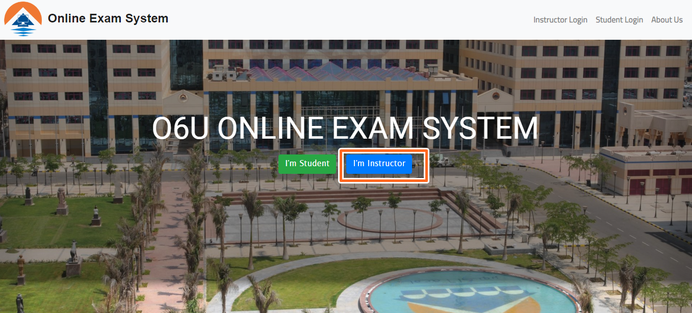

# Admin Login 
>Add Admin Email And Password 

>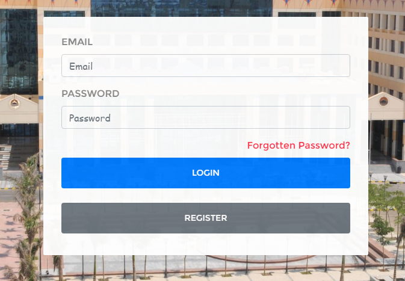

# Admin Profile 
>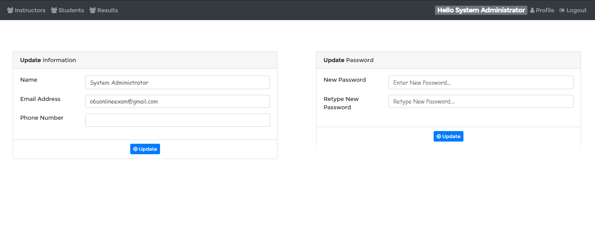

# Manage Instructors

>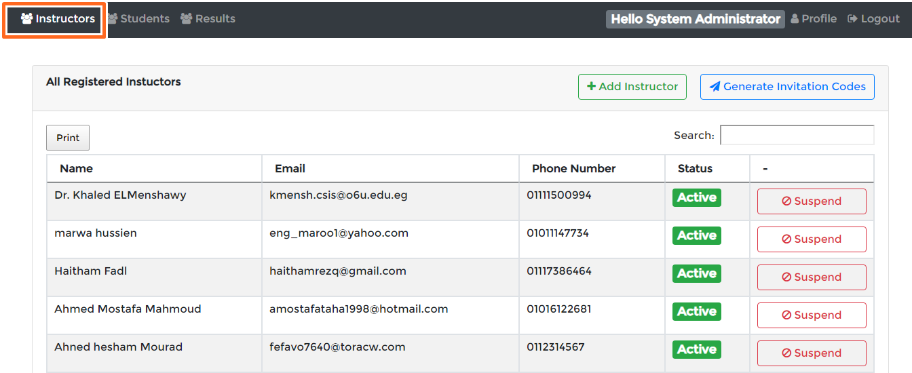

> Generate Invitation Code 

>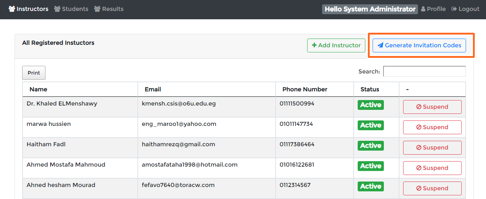
>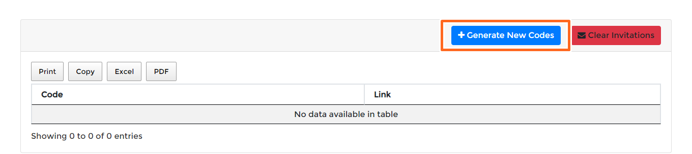

> Add Number Of Code 

>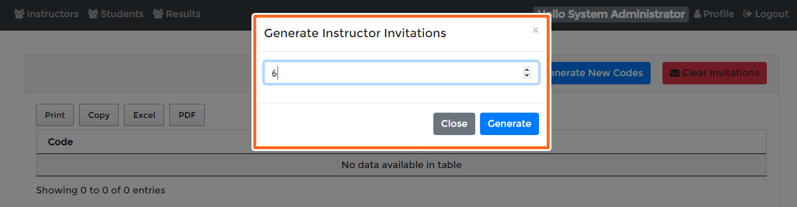

> You Can Print or Copy Or Make Pdf Or Excel Sheet For The Codes Or Copy The Like 
> You Can Remove Code Invitation 

>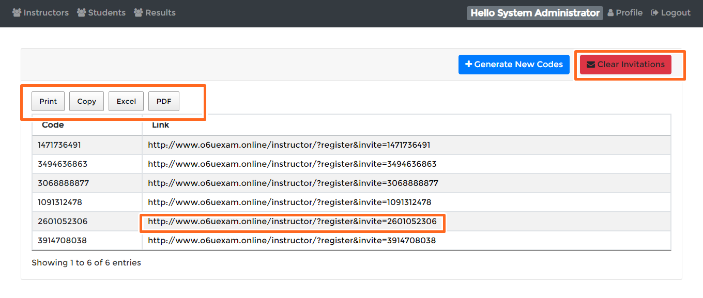

>You Can Suspend And Activate An Instructor

>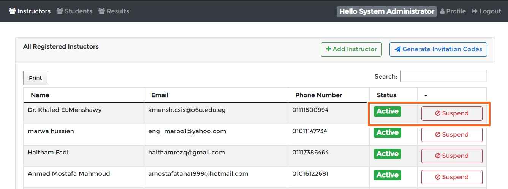

# Add Instructors

>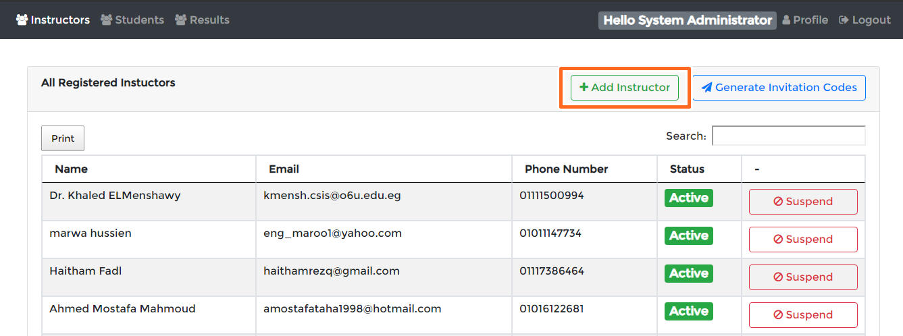

>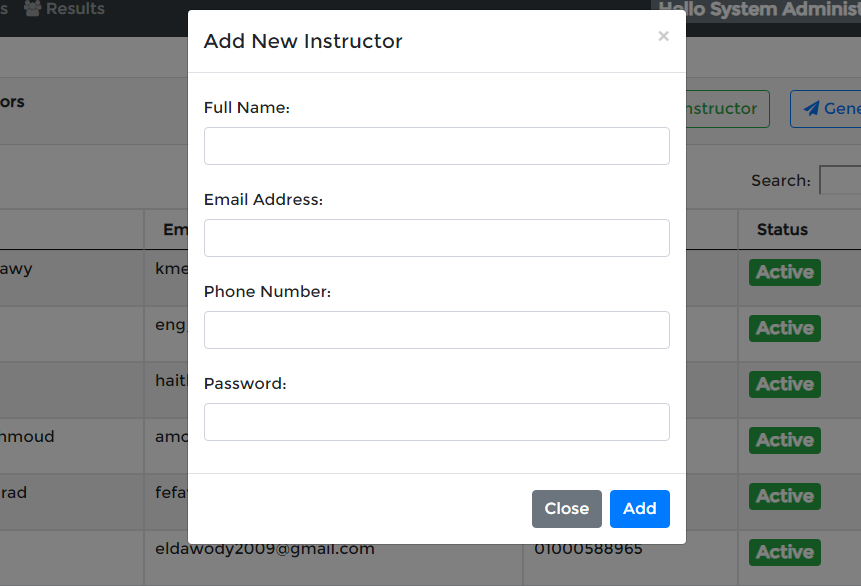

# Manage Students

>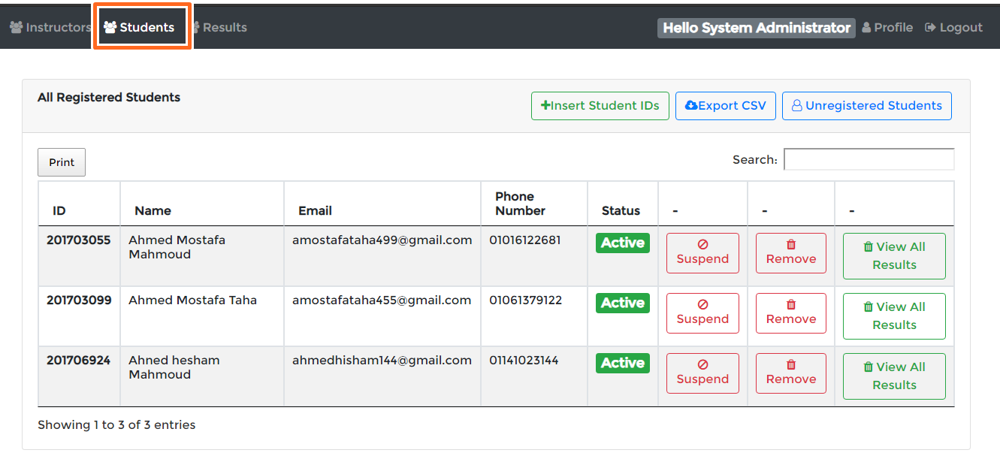

> Insert  Students ID'S

>Note: Admin Should Add students IDS in the System Because The Students Can't Register Without His IDs In-system

>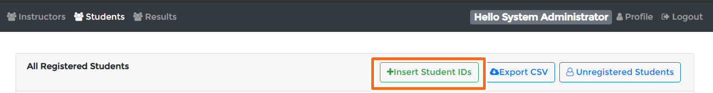

> Add Each ID in Line 

>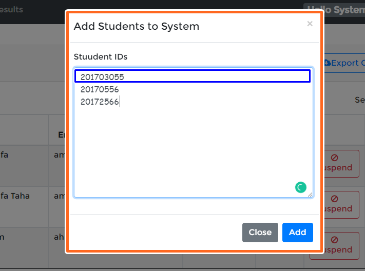

>UnRegister Students the Students Have Not to Add His Information in the system

>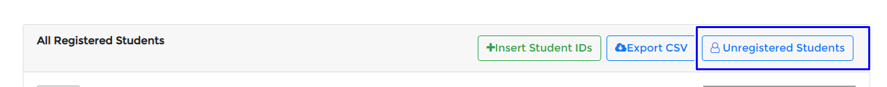

>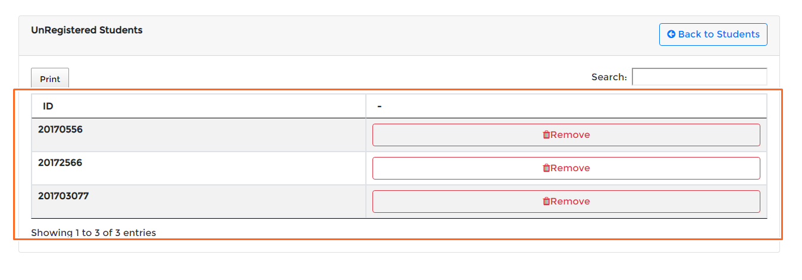

>Students Have  Informations You Can Delete Him Or Active Or Suspend 

>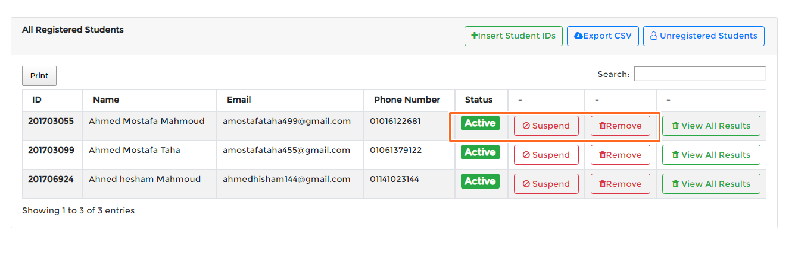

> Can Export Students 

>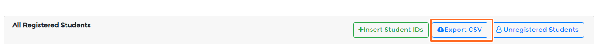

>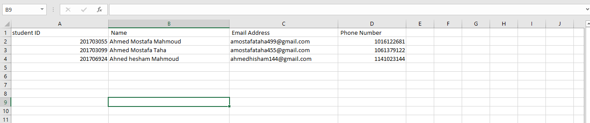

> Can View The Result of Each Student 

>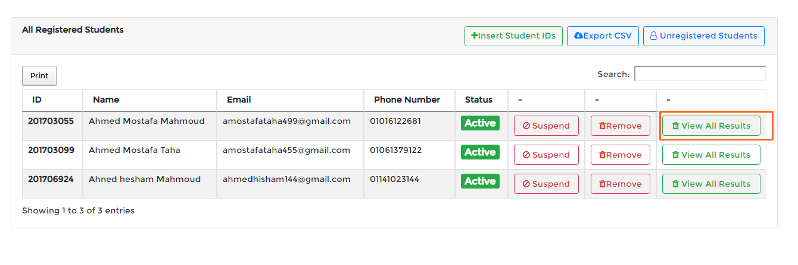

>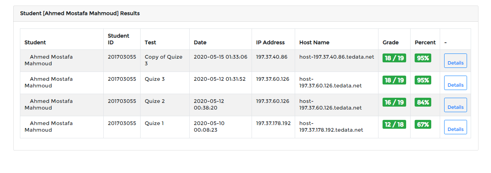

> View All Students Results

>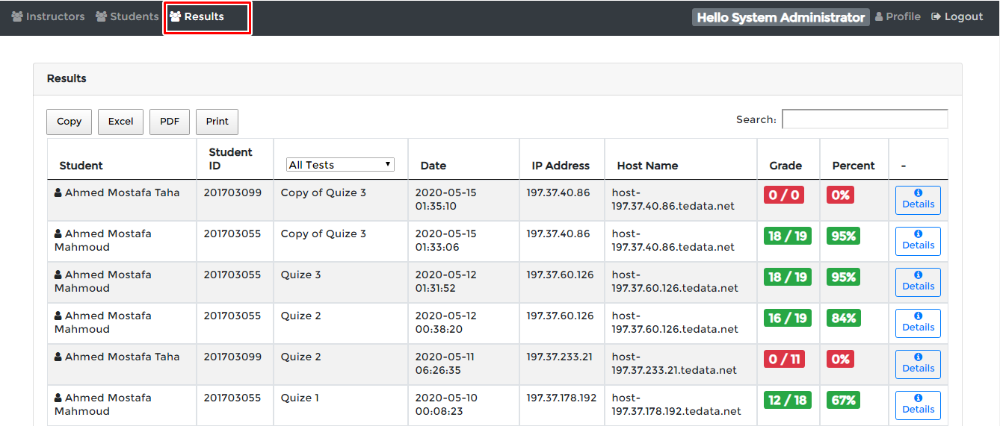

